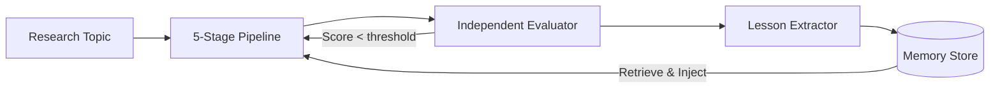

# 🔬 EvoResearch

**A self-improving AI research pipeline. Each run learns from the last.**

[](https://python.org)
[](https://github.com/your-username/evo-research/actions)
[](LICENSE)
[](#providers)
[](tests/)

---

## What is this?

EvoResearch is a local research pipeline that **gets smarter with every run**.

Most AI research tools execute a pipeline and stop. EvoResearch goes further:

1. **Runs** a full research pipeline (literature → hypotheses → experiments → writeup)
2. **Evaluates** each stage independently, with no memory bias
3. **Extracts** structured lessons from what went wrong and what worked
4. **Stores** lessons in a persistent memory store
5. **Retrieves and injects** relevant lessons into the next run — making it better

> The evaluator is deliberately isolated from memory. Lessons only influence *proposals* — never *judgments*.

---

## The Evolution Loop



**Real evolution trace** (topic: "Iterative feedback in LLM-based research pipelines"):

```
Run 1:  A:7, B:7, C:6, D:5, E:5  → Overall 6/10 weak   (0 lessons in memory)
Run 2:  A:7, B:7, C:5, D:8, E:5  → Overall 6/10 weak   (7 lessons; disclosure rule learned)
Run 3:  A:7, B:7, C:7, D:7, E:7  → Overall 7/10 weak   (skills v1 promoted from 15 lessons)
Run 4:  A:7, B:7, C:7, D:7, E:7  → Overall 7/10 pass   (skills v2; section-by-section writeup)
Run 5:  A:7, B:8, C:7, D:8, E:7  → Overall 7/10 weak   (skills v3; hypothesis criteria skill)
Run 6:  A:7, B:8, C:7, D:8, E:7  → Overall 7/10 pass   (skills v4; lit scan skill injected)
...
Run 9:  A:8, B:8, C:6, D:8, E:9* → Overall 7/10 weak   (token fix for hypotheses; E retried)
Run 10: A:6, B:9, C:5, D:9, E:9* → Overall 7/10 weak   (stricter rubrics; quality gate catches more)
Run 11: A:6, B:8, C:6, D:8, E:8  → Overall 7/10 pass   (Stage C two-phase generation)
Run 12: A:7, B:9, C:6, D:8, E:8  → Overall 7/10 pass   (synthesis table column fix)
Run 13: A:8, B:9, C:8*, D:8, E:9 → Overall 8/10 pass 🎯 (token budget for reasoning overhead)
Run 15: A:9, B:8, C:8,  D:8, E:8 → Overall 8/10 pass 🎯 (2nd topic: CoT vs direct prompting)
Run 16: A:9, B:9, C:8,  D:8, E:8 → Overall 9/10 pass 🎯 (skills v5; 115 lessons accumulated)

* stage retried via quality gate (score < 6 triggers automatic retry with evaluator feedback)
```

The system reached **9/10 pass** on Run 16 after 115 accumulated lessons and 6 promoted skills.
Key insight: MiniMax-M2.7-highspeed's reasoning overhead (~2000-3000 tokens per call) required
generously sized max_tokens budgets. Stage C was split into two-phase generation (plan + code)
to prevent either phase from truncating the other. Scores improved from 6→9 over 16 runs — the
evolution loop works across diverse topics.

---

## Quick Start

```bash
# 1. Install
pip install -e .

# 2. Set your API key (pick one)
export DEEPSEEK_API_KEY="sk-..."      # Recommended — cheap, fast
export OPENAI_API_KEY="sk-..."        # GPT-4o
export MINIMAX_API_KEY="sk-cp-..."    # MiniMax M1/M2
export ANTHROPIC_API_KEY="sk-ant-..." # Claude

# 3. Configure provider in config/local.yaml (copy from default.yaml)
cp config/default.yaml config/local.yaml
# Edit: set provider.name and provider.api_key

# 4. Run
research-evo run "The impact of iterative feedback on LLM research quality"

# 5. Run again — watch the lessons kick in
research-evo run "The impact of iterative feedback on LLM research quality" --show-lessons

# 6. View dashboard
research-evo serve
```

---

## Pipeline Stages

| Stage | Output | Lesson Injection | Skill Injection |
|-------|--------|-----------------|-----------------|
| **A: Literature Scan** | `literature_notes.md`, `citations.json` | — (bias-free) | ✅ (structure) |
| **B: Hypothesis Generation** | `hypotheses.md`, `hypotheses.json` | ✅ | ✅ |
| **C: Experiment Plan** | `experiment_plan.md`, `experiment_code.py` | ✅ | ✅ |
| **D: Result Summary** | `results.md`, `results.json` | — (honesty) | ✅ (structure) |
| **E: Draft Writeup** | `draft.md` (8 sections) | ✅ | ✅ |

Lessons influence *proposals* (stages B, C, E). Skills (distilled from many lessons) guide *structure* for all stages.
Evaluator and Reviewer receive **neither** — scores reflect true quality.

After each pipeline:
- **Stage Evaluator** scores each stage (0–10) — *never* reads memory
- **Run Reviewer** reviews the full run holistically — *never* reads memory
- **Lesson Extractor** pulls structured lessons from the review
- Lessons are persisted to `memory/lessons.jsonl`

---

## Key Design Principles

### 1. Evaluator Isolation
The evaluator and reviewer are **physically isolated from lesson memory**. They only see the current run's output. This prevents memory from distorting verdicts and ensures each run's score is a true measurement.

### 2. Lessons Must Be Structured
Raw logs don't go into memory. Every lesson requires:
- `summary` — what happened and why
- `reuse_rule` — actionable instruction for next run
- `evidence` — specific artifact references
- `confidence` — 0.0–1.0 score
- `anti_pattern` — what NOT to do

### 3. Quality Gate with Auto-Retry
If a stage scores below the threshold (default: 5/10), it automatically retries with the evaluator's specific feedback injected. The system self-corrects before moving to the next stage.

### 4. Local-First
Everything runs locally. Artifacts are plain files (JSON, Markdown). No database required. Easy to inspect, version, and share.

---

## Providers

| Provider | Env Var | Default Model | Notes |
|----------|---------|---------------|-------|
| `deepseek` | `DEEPSEEK_API_KEY` | `deepseek-chat` | Best cost/quality ratio |
| `openai` | `OPENAI_API_KEY` | `gpt-4o` | Widely available |
| `minimax` | `MINIMAX_API_KEY` | `MiniMax-M2.7-highspeed` | Reasoning model; allocate generous token budgets (~3000 reserved for reasoning overhead) |
| `glm` | `GLM_API_KEY` | `glm-4` | Zhipu AI |
| `anthropic` | `ANTHROPIC_API_KEY` | `claude-sonnet-4-6` | Requires `pip install anthropic` |

---

## Commands

```bash
# Run pipeline
research-evo run "your topic" [--provider deepseek] [--model deepseek-chat] [--show-lessons]

# Web dashboard
research-evo serve [--port 8080]

# Compare two runs
research-evo compare run-20260101-120000-abc123 run-20260101-130000-def456

# View lessons
research-evo list-lessons [--stage hypothesis_generation] [--type failure_pattern]
research-evo memory-stats

# Export run artifacts
research-evo export run-20260101-120000-abc123

# List runs
research-evo list-runs
```

---

## Artifact Structure

```
artifacts/
└── run-YYYYMMDD-HHMMSS-{id}/
    ├── metadata.json          ← run state, stage scores, provider info
    ├── run_review.json        ← holistic review (evaluator-isolated)
    ├── review.md              ← human-readable review
    ├── lessons.json           ← lessons extracted from this run
    └── stages/
        ├── literature_scan/literature_notes.md
        ├── hypothesis_generation/hypotheses.md
        ├── experiment_plan_or_code/experiment_plan.md
        ├── experiment_result_summary/results.md
        └── draft_writeup/
            ├── draft.md       ← full assembled report
            └── sections/      ← per-section files (abstract, intro, etc.)

memory/
├── lessons.jsonl              ← global lesson store (append-only)
└── retrieval_debug/           ← which lessons were retrieved per run
```

---

## Configuration

```yaml
# config/local.yaml (gitignored — put your keys here)
provider:
  name: deepseek
  api_key: "sk-..."
  model: ""              # empty = provider default

model:
  max_tokens: 6000

quality_gate:
  enabled: true
  min_score: 5           # retry stage if score below this
  max_retries: 1

memory:
  max_retrieved_lessons: 5
  min_confidence: 0.5
```

---

## Architecture

```
src/
├── llm_client.py              # Multi-provider client with retry + think-tag stripping
├── orchestrator/
│   ├── run_manager.py         # Orchestrates pipeline + quality gates
│   └── stage_runner.py        # Single-stage execution with timing
├── pipeline/                  # 5 stage implementations (all extend BaseStage)
├── evaluator/
│   ├── stage_evaluator.py     # ← NEVER reads lesson memory (isolation)
│   ├── run_reviewer.py        # ← NEVER reads lesson memory (isolation)
│   └── rubric.py              # Stage-specific scoring criteria
├── evolution/
│   ├── lesson_schema.py       # Lesson dataclass
│   ├── memory_store.py        # JSONL persistence
│   ├── retrieval.py           # Tag + stage-based retrieval
│   ├── injection.py           # Formats lessons for prompt injection
│   ├── skill_promoter.py      # Promotes high-confidence lessons → reusable skills
│   └── lesson_extractor.py    # LLM-based lesson extraction from review
├── dashboard/                 # FastAPI web dashboard (dark theme + charts)
└── mcp_server.py              # MCP server for agent integration

tests/
├── test_llm_client.py         # LLM client unit tests (38 cases)
├── test_retrieval.py          # Lesson retrieval unit tests
└── test_memory_store.py       # Memory persistence unit tests

.github/workflows/ci.yml       # CI: test on Python 3.10/3.11/3.12, Docker build
```

---

## The Theory Behind It

This system is inspired by two papers and one key insight:

- **AutoResearch / AutoResearchClaw**: automated research pipelines
- **EvoScientist**: evolution of scientific reasoning through experience

The key insight from *LLM Research Depth Convergence*:

> LLM research effectiveness = `model_prior × context_update × reward_fidelity × iteration_budget`

EvoResearch maximizes `context_update` (lesson injection) and `reward_fidelity` (isolated evaluator), making each iteration more effective than random retry.

The lesson extraction system is the "evolution memory layer" — it transforms ephemeral run output into structured, reusable knowledge.

---

## Roadmap

- [ ] Embedding-based semantic lesson retrieval (vs. keyword overlap)
- [ ] Multi-topic lesson transfer (cross-domain memory)
- [ ] Real literature search integration (Semantic Scholar / arXiv)
- [ ] Parallel hypothesis exploration (multiple runs → merge best)
- [ ] Code execution sandbox for real experiments
- [ ] Lesson quality scoring via automated review
- [ ] Export to PDF / LaTeX

---

## Contributing

Contributions welcome. Key areas:
- **New pipeline stages**: extend `BaseStage`, register in `run_manager.py`
- **New providers**: add to `PROVIDERS` dict in `llm_client.py`
- **Better retrieval**: replace keyword scoring in `retrieval.py`
- **Richer dashboard**: templates in `src/dashboard/templates/`

---

## License

MIT — see [LICENSE](LICENSE)

---

*Built on the principle that a research system that learns from its own failures is more valuable than one that runs faster.*

---

<details>
<summary>中文说明</summary>

EvoResearch 是一个自我改进的 AI 科研流水线。核心思路：

- 每次 run 会从 literature scan → 假设生成 → 实验计划 → 结果总结 → 写作 走完一条完整流水线
- 独立的 Evaluator 给每个 stage 打分（不接触 memory，保持评判中立）
- Lesson Extractor 从每次 run 中抽取结构化的经验教训（failure/success/guardrail 等）
- 下次 run 时，相关 lessons 被注入到 hypothesis generation、experiment plan 等环节
- Quality Gate：如果某 stage 分数过低，自动用 evaluator feedback 重试

使用方法见上方 Quick Start（把 API key 换成对应 provider 的 key 即可）。
</details>
